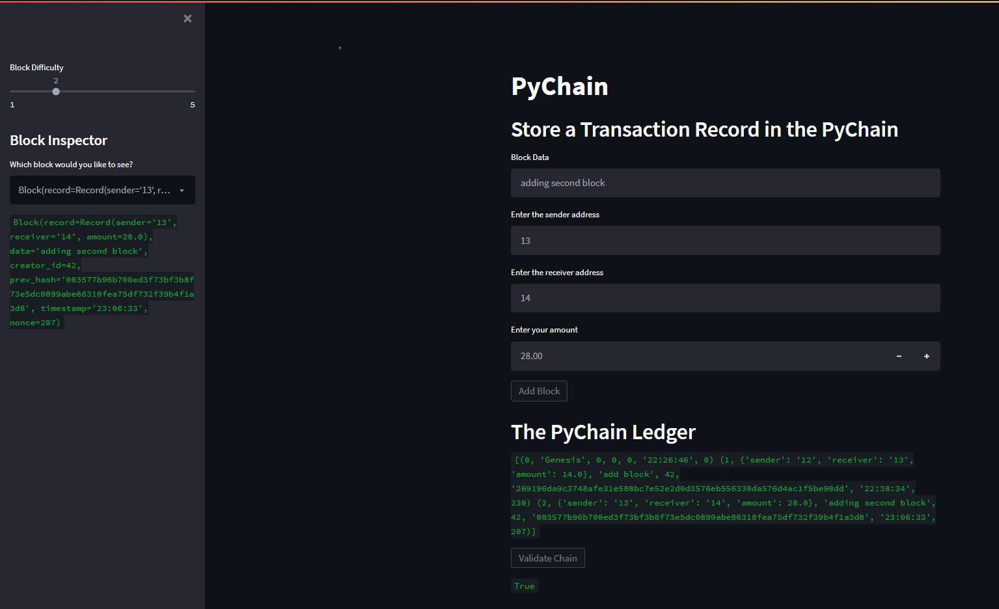

# PyChain Blockchain!

## A working local blockchain

This code replicates the theory behind a working blockchain. 

First the user will input the data they want to store, they'll indicate the sender, receiver and an amount to send. 

Upon clicking "Add Block" you will submit the block. It will then be "mined" (theorettically, but not in practice) and added to the block chain.

You can increase the difficulty of mining, which will add more 0's to the begining of the winnig hash. Doing this will increase the time to mine, but also increase the mining reward (theoretically).

As you add blocks you will see that on the side bar you can select individual blocks to see their respective information. 

Beneath PyChain Ledger you'll see the entire block chain. You can then click Validate Chain to check that the previous hash on the current block matches the hash of the previous block. If they do the program will return True, otherwise you will see Flase printed.

You'll see in the image below an example of how it works.

***Due to a bug in Streamlit the dataframe is shown as a list of dictionaries. With future Streamlit updates it should display as a formatted dataframe***

